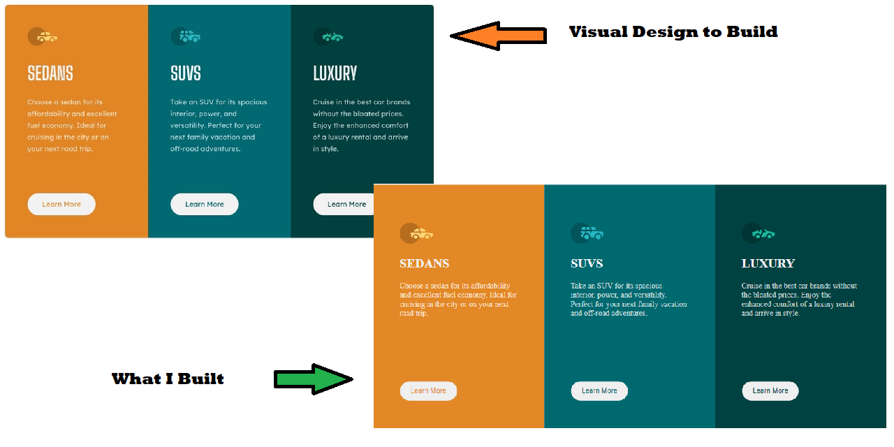

Responsive 3 column card component built with HTML & CSS



This is a solution to the [3-column preview card component challenge on Frontend Mentor](https://www.frontendmentor.io/challenges/3column-preview-card-component-pH92eAR2-). Frontend Mentor challenges help you improve your coding skills by building realistic projects. 

## Table of contents
- [The challenge](#the-challenge)
- [Screenshot](#screenshot)
- [Links](#links)
- [Built with](#built-with)
- [What I learned](#what-i-learned)
- [Useful resources](#useful-resources)
- [Author](#author)

### The challenge

Users should be able to:

- View the optimal layout depending on their device's screen size
- See hover states for interactive elements

### Links
- [Click to play with the solution](https://dev.to/jcsmileyjr/frontend-challenge-3-three-column-card-component-3kik)
- [Blog post describing the development journey of this project](https://dev.to/jcsmileyjr/frontend-challenge-3-three-column-card-component-3kik/edit)

### Built with

- Semantic HTML5 markup
- CSS custom properties
- Flexbox
- Mobile-first workflow
- HTML


### What I learned

1. Retouched the BEM naming conventions
2. Brief reminder of how to utilize a SVG image.
3. Realized how much more practice I need with responsive designs

Sample code below showing BEM naming conventions(Block-Element-Modifier) !!!
```html
        <article class="sedan">
          <section>
            
            <h2>Sedans</h2>
            <p class="sedan__content">
              Choose a sedan for its affordability and excellent fuel economy. Ideal for cruising in the city 
            or on your next road trip.
            </p>
          </section>
          <section>
            <button type="button" class="sedan__button">Learn More</button>
          </section>
        </article>
```

### Useful resources

- [Site about BEM](http://getbem.com/naming/) Recap of BEM naming conventions
- [Free Code Camp tips on SVG images](https://www.freecodecamp.org/news/use-svg-images-in-css-html/) for guidance using an SVG image.


## Author

- Website - [Portfolio website](https://www.jcsmileyjr.com)
- Frontend Mentor - [@jcsmileyjr](https://www.frontendmentor.io/profile/jcsmileyjr)
- Twitter - [@JCSmiley4](https://twitter.com/JCSmiley4)
